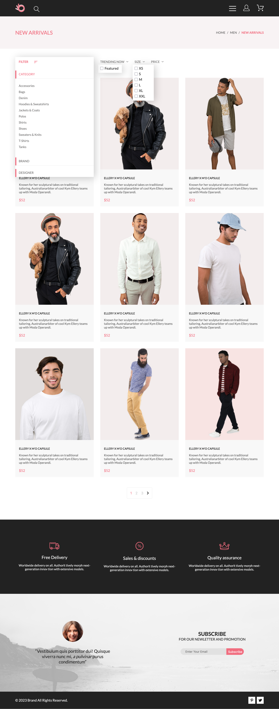
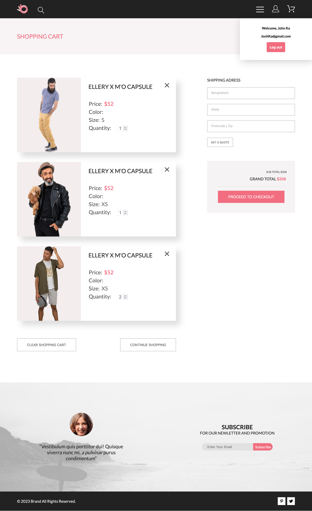

# Online Store — Fullstack E-commerce App

## О проекте
Fullstack интернет-магазин с клиентской частью на React и серверной частью на Node.js + Express.

Реализована аутентификация пользователей, работа с корзиной, фильтрация и сортировка каталога, взаимодействие с PostgreSQL (Supabase) через REST API.

Проект демонстрирует навыки разработки клиент-серверных приложений, управления состоянием на frontend и организации backend-логики.

## 📸 Screenshots

### Главная страница с выпадающим меню


### Адаптивная версия (mobile)


### Каталог с фильтрацией и сортировкой


### Корзина и оформление заказа


## Технологический стек
* **Frontend:**
    * **React.js (Hooks)**
    * **React Router v6**
    * **Context API** (AuthContext, CartContext)
    * **Axios**
    * **SCSS (BEM)**
    * **SPA-навигация**
* **Backend:**
    * **Node.js**
    * **Express.js**
    * **REST API**
    * **Supabase (PostgreSQL + Auth)**
    * **JWT-аутентификация**
* **Инструменты:**
    * **Git**
    * **Figma (вёрстка по макету)**

## Реализованный функционал
* **Аутентификация:**
    * Регистрация и авторизация пользователя (email + password)
    * Получение и хранение JWT-токена
    * Проверка авторизации при выполнении защищённых действий
    * Управление состоянием пользователя через AuthContext
* **Каталог товаров:**
    * Получение данных с сервера
    * Пагинация
    * Фильтрация (размер, featured)
    * Сортировка по цене (ASC / DESC)
    * Страница отдельного товара
* **Корзина:**
    * Добавление товара
    * Изменение количества
    * Удаление позиции
    * Очистка корзины
    * Подсчёт общей стоимости
    * Синхронизация с базой данных
    * Привязка корзины к авторизованному пользователю

## Архитектурные решения
* Разделение frontend и backend (SPA + REST API)
* Организация backend по слоям (routes → controllers)
* Отдельный слой services для работы с API
* Управление глобальным состоянием через React Context
* Асинхронная работа с сервером (CRUD-операции)
* Обработка ошибок на клиенте и сервере

## Структура проекта
* **Client**
```
client/
├── assets/              
├── components/          
├── pages/               
├── context/             
├── services/     
├── utils/       
├── styles/              
├── App.js
└── index.js
```
* **Server**
```
server/
├── routes/                  
├── controllers/             
├── services/                               
└── index.js
```

## Структура базы данных
* **users**
    * id (UUID)
    * email
    * password
    * first_name
    * last_name
    * gender
* **products**
    * id (UUID)
    * img
    * name
    * info
    * price
    * color
    * size
    * is_featured
* **cart**
    * id (UUID)
    * user_id → users.id
    * product_id → products.id
    * quantity
    * color
    * size

## Установка и запуск
* **Backend**
```
cd 1.online-store-app/server
npm install
npm run start
```
Сервер:<br>
http://localhost:3001
* **Frontend**
```
cd 1.online-store-app/client
npm install
npm start
```
Приложение:<br>
http://localhost:3000

## Возможные улучшения
* Восстановление сессии пользователя
* История заказов
* Админ-панель
* Поиск по каталогу
* Улучшенная обработка ошибок

## Автор
Илья Карпов<br>
Junior Fullstack Developer (React, Node.js)

## Контакты
Email: ilya.karpov.93@mail.ru<br>
GitHub: https://github.com/bullet554<br>
Phone: +79372382299 (WhatsApp, Telegram, Max)