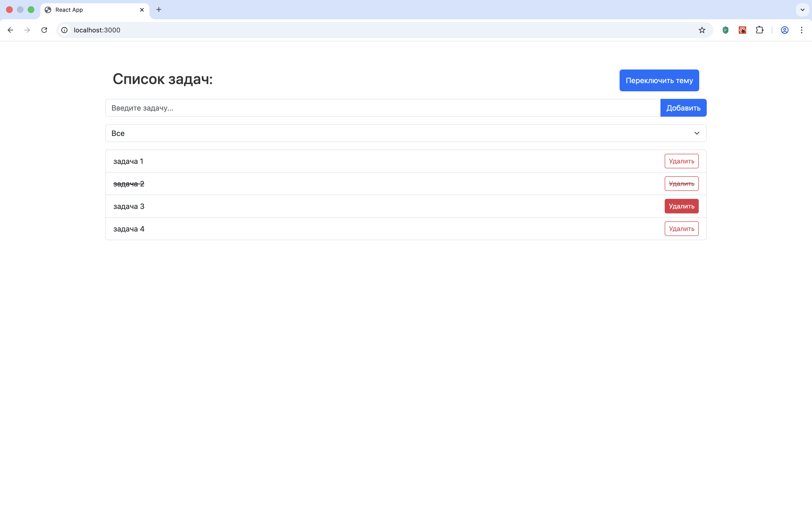
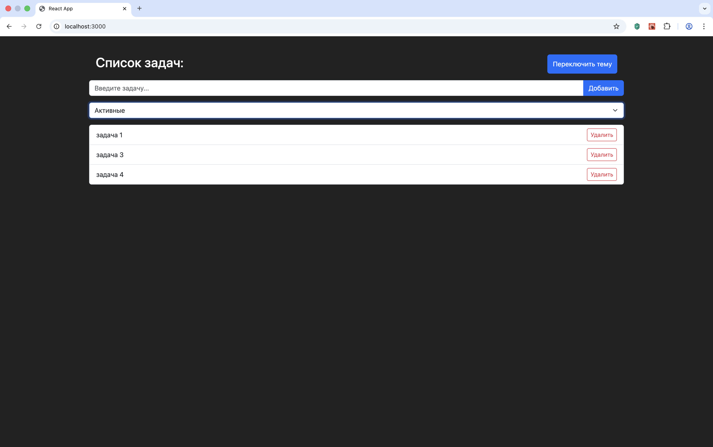
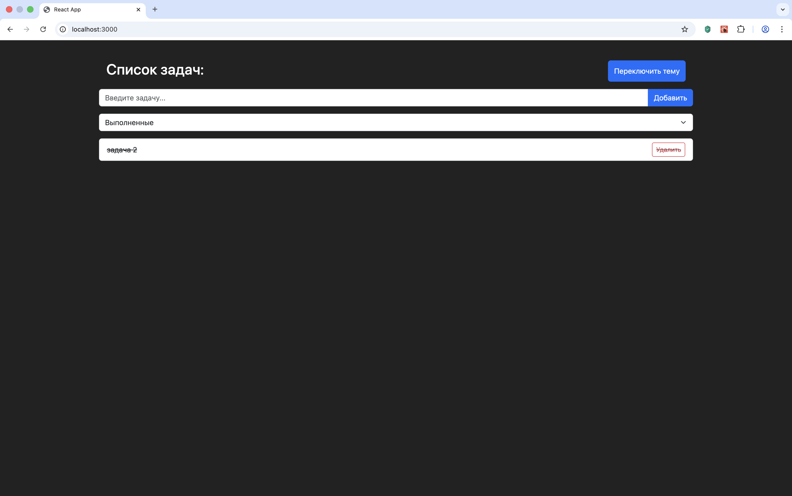

# Todo List — Fullstack Task Management Application

## О проекте
Fullstack веб-приложение для управления задачами с клиентской частью на React и серверной частью на Node.js + Express.

Реализована асинхронная загрузка данных через createAsyncThunk, централизованное управление состоянием через Redux Toolkit и взаимодействие клиента с REST API.

Проект демонстрирует навыки работы с глобальным состоянием, организации frontend-архитектуры и построения backend API.

## 📸 Screenshots

### Главная страница


### Темная тема и фильтр “Активные”


### Темная тема и фильтр “Выполненные”


## Технологический стек
* **Frontend:**
    * **React.js** (Hooks)
    * **Redux Toolkit** (createSlice, createAsyncThunk)
    * **React Redux**
    * **Axios**
    * **React Bootstrap**
    * **Context API** (ThemeContext, FilterContext)
    * **SCSS**
* **Backend:**
    * **Node.js**
    * **Express.js**
    * **REST API**
    * **Файловое хранилище (JSON)**
    * **Асинхронная обработка запросов**
* **Инструменты:**
    * **Git**
    * **UUID (генерация ID)**
    * **Proxy-настройка для API**

## Реализованный функционал
* **Управление задачами:**
    * Получение задач с сервера
    * Создание новой задачи
    * Изменение статуса выполнения
    * Удаление задачи
    * Автоматическая генерация ID
    * Сохранение данных на сервере
* **Асинхронное взаимодействие:**
    * Загрузка задач через createAsyncThunk 
    * Обработка состояний: loading / succeeded / failed
    * Централизованное управление состоянием через Redux
* **Интерфейс и UX:**
    * Переключение светлой / тёмной темы
    * Фильтрация: Все / Активные / Выполненные
    * Адаптивная верстка
    * Обработка ошибок

## Архитектурные решения
* Разделение frontend и backend (SPA + REST API)
* Централизованное управление состоянием через Redux Toolkit 
* Использование createAsyncThunk для работы с API
* Разделение логики фильтрации через HOC (withFilter)
* Асинхронная работа с сервером (CRUD-операции)
* Централизованная обработка ошибок на сервере

## Структура проекта
```
2.todo-list-react/
├── client/
│   ├── src/
│   │   ├── component/
│   │   ├── contexts/
│   │   ├── slices/
│   │   ├── hoc/
│   │   ├── styles/
│   │   ├── App.js
│   │   ├── store.js
│   │   └── index.js
│   └── package.json
│
├── server/
│   ├── index.js
│   ├── tasks.json
│   └── package.json
│
└── README.md
```

## Установка и запуск
* **Backend**
```
cd 2.todo-list-react/server
npm install
npm run start
```
Сервер:<br>
http://localhost:5001
* **Frontend**
```
cd 2.todo-list-react/client
npm install
npm start
```
Приложение:<br>
http://localhost:3000

## Возможные улучшения
* Перенос хранения данных в PostgreSQL
* JWT-аутентификация
* Разделение backend на слои (routes / controllers / services)
* Добавление тестов
* Оптимизация обработки ошибок

## Автор
Илья Карпов<br>
Junior Fullstack Developer (React, Node.js)

## Контакты
Email: ilya.karpov.93@mail.ru<br>
GitHub: https://github.com/bullet554<br>
Phone: +79372382299 (WhatsApp, Telegram)