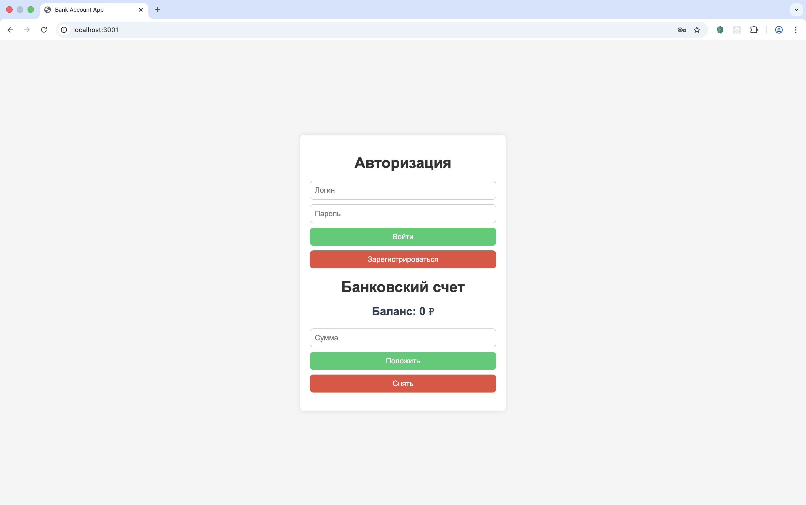
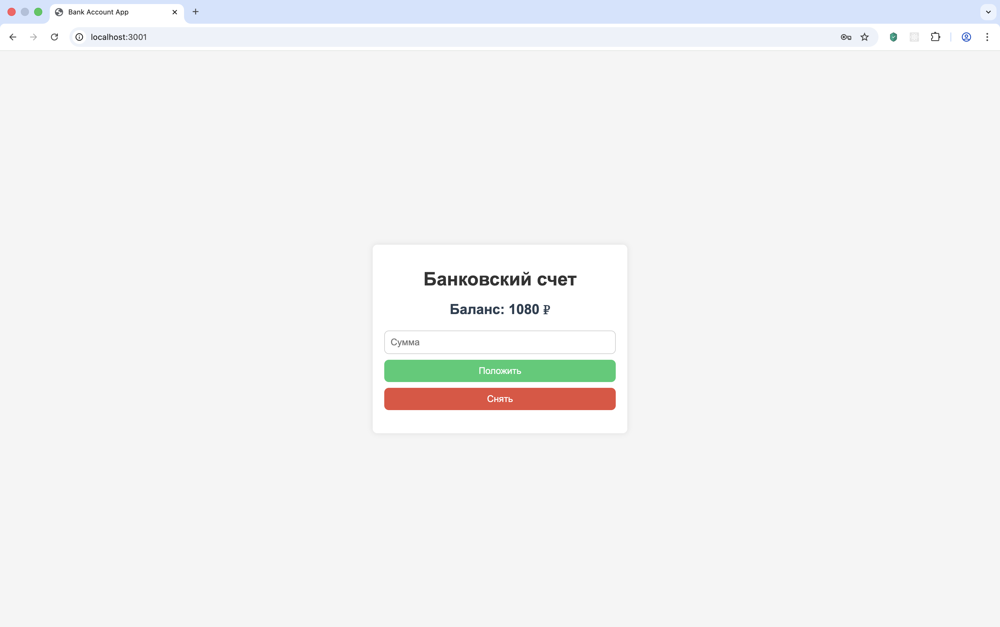
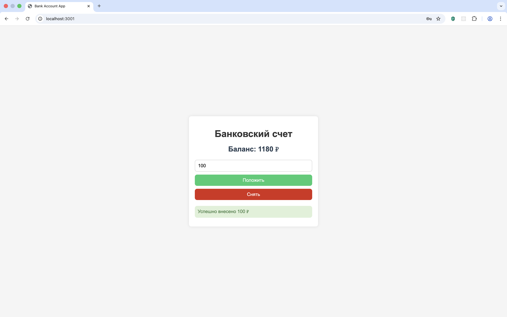

# Bank App — Fullstack Banking Application

## О проекте
Fullstack веб-приложение для управления банковскими счетами.

Пользователь может зарегистрироваться, авторизоваться, управлять балансом, выполнять операции пополнения и списания средств.
Реализована серверная логика обработки операций и взаимодействие клиента с REST API.

Проект делал для практики серверной бизнес-логики и обработки пользовательских операций.

## Screenshots

### Страница регистрации / авторизации


### Главная панель пользователя


### Выполнение операций с балансом


## Технологический стек
* **Frontend:**
    * **HTML5**
    * **CSS3**
    * **JavaScript (ES6+)**
    * **Fetch API**
* **Backend:**
    * **Node.js**
    * **Express.js**
    * **REST API**
    * **Работа с файловым хранилищем (JSON)**
* **Инструменты:**
    * **Git**
    * **Postman (тестирование API)**

## Реализованный функционал
* **Аутентификация:**
    * Регистрация пользователя
    * Авторизация по логину и паролю
    * Валидация пользователя при регистрации и авторизации
    * Обработка ошибок при входе
* **Управление балансом:**
    * Создание счета при регистрации
    * Пополнение баланса
    * Списание средств
    * Серверная логика проверки операций (запрет ухода в минус, контроль баланса)
* **Backend-логика:**
    * Обработка операций с балансом на сервере
    * Асинхронная работа с хранилищем
    * Обработка ошибок на сервере
    * Проверка входных данных

## Архитектурные решения
* Разделение frontend и backend
* Клиент взаимодействует с сервером через REST API
* Логика работы со счётом вынесена в отдельный класс
* Асинхронная обработка операций
* Обработка ошибок на сервере

## Структура проекта
```
3.bank-app/
├── client/
│   ├── index.html
│   ├── script.js
│   └── css/
│
├── server.js
├── usersData.json
└── README.md
```

## Установка и запуск
* **Backend**
```
cd 3.bank-app
npm install
node server.js
```
* **Frontend**<br>
Открыть в браузере:<br>
http://localhost:3001

## Возможные улучшения
* Хеширование паролей (bcrypt)
* JWT-аутентификация
* Перенос хранения данных в PostgreSQL
* История операций пользователя
* Разделение backend на слои (routes / controllers / services)
* Docker-конфигурация

## Автор
Илья Карпов<br>
Junior Fullstack Developer (React, Node.js)

## Контакты
Email: ilya.karpov.93@mail.ru<br>
GitHub: https://github.com/bullet554<br>
Phone: +79372382299 (WhatsApp, Telegram, Max)