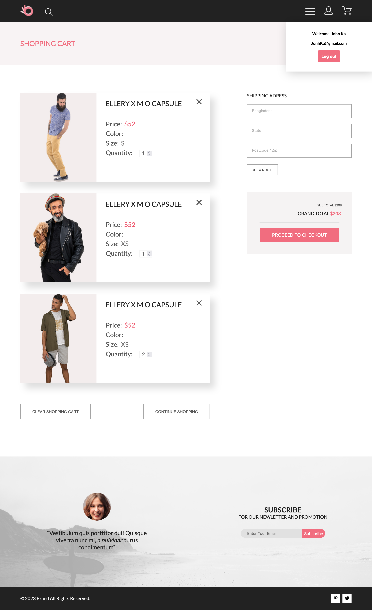

# # Online Store — Fullstack E-commerce App

## Описание проекта
**Полнофункциональное fullstack веб-приложение интернет-магазина** реализованное с использованием React на клиенте и Node.js + Supabase на сервере.
Проект демонстрирует работу с аутентификацией пользователей, корзиной товаров, фильтрацией и сортировкой каталога, а также взаимодействие с базой данных через REST API.

Проект создан как учебный fullstack кейс для демонстрации навыков разработки клиент-серверных приложений.

## 📸 Screenshots

### Главная страница с выпадающим меню


### Главная страница (мобильная версия)


### Каталог товаров с выпадающими сортировками и фильтром


### Страница корзины с выпадающей авторизацией


## Ключевые особенности
* **Клиент-серверное взаимодействие:**
    * REST API для работы с товарами и корзиной
    * Асинхронные запросы (fetch / axios)
    * Хранение данных корзины в БД
    * Привязка корзины к авторизованному пользователю
    * Обработка ошибок на клиенте и сервере
* **Аутентификация:**
    * Авторизация пользователей (email + password)
    * Хранение JWT-токена
    * Контекст авторизации (AuthContext)
    * Защита действий (добавление в корзину только для авторизованных)
* **Каталог товаров:**
    * Получение товаров с сервера
    * Пагинация
    * Фильтрация:
        * по размеру
        * по featured (хиты продаж)
    * Сортировка:
        * по цене (возрастание / убывание)
* **Корзина:**
    * Добавление товара в корзину
    * Изменение количества
    * Удаление отдельного товара
    * Очистка всей корзины
    * Подсчёт общей стоимости
    * Синхронизация корзины с БД
* **Пользовательский интерфейс:**
    * Адаптивная вёрстка (desktop / tablet / mobile)
    * SCSS + BEM-нейминг
    * Выпадающие меню и модальные окна
    * SPA-навигация через React Router

## Технологии и инструменты

* **Frontend:**
    * **React.js**
    * **React Router v6**
    * **Context API** (AuthContext, CartContext)
    * **SCSS**
    * **BEM**
    * **PropTypes**
* **Backend:**
    * **Node.js**
    * **Express.js**
    * **Supabase:**
        * PostgreSQL
        * Auth
    * **REST API**
* **Дополнительно:**
    * **JWT**
    * **Git**
    * **Figma (вёрстка по макету)**

## Функционал
* **Пользователь:**
    * Регистрация
    * Авторизация
    * Выход из аккаунта
* **Товары:**
    * Просмотр каталога
    * Просмотр страницы товара
    * Просмотр featured-товаров
    * Пагинация
* **Корзина:**
    * Добавление товара
    * Изменение количества
    * Удаление товара
    * Очистка корзины
    * Подсчёт итоговой стоимости

## Установка и запуск
1. Клонируйте репозиторий:
```
git clone https://github.com/bullet554/portfolio.git
```
2. Серверная часть:
```
cd 8.online-store-app/server
npm install
npm run start
```
3. Сервер будет запущен на:
```
http://localhost:3001
```
4. Клиентская часть:
```
cd 8.online-store-app/client
npm install
npm start
```
5. Приложение будет доступно по адресу:
```
http://localhost:3000
```


## Архитектура проекта
* **Клиент:**
```
client/
├── src/
│   ├── assets/              # Иконки и фоны
│   ├── components/          # UI-компоненты
│   ├── pages/               # Страницы (Home, Catalog, Cart, Product)
│   ├── context/             # AuthContext, CartContext
│   ├── services/            # API
│   ├── styles/              # Глобальные и page-стили
│   ├── App.js
│   └── index.js
```
* **Сервер:**
```
server/
├── routes/                  # API маршруты
├── controllers/             # Логика обработки запросов
├── services/                # Работа с Supabase
├── index.js                 # Точка входа
└── package.json
```

## Структура базы данных (Supabase)
* **users**
    * id (UUID)
    * email
    * password
    * first_name
    * last_name
    * gender
* **products**
    * id (UUID)
    * img
    * name
    * info
    * price
    * color
    * size
    * is_featured
* **cart**
    * id (UUID)
    * user_id → users.id
    * product_id → products.id
    * quantity
    * color
    * size

## Возможности для улучшения
* Восстановление сессии пользователя по токену
* Оформление заказов
* История заказов
* Админ-панель
* Поиск по каталогу
* Фильтрация по цене
* Избранные товары

## Автор
Илья Карпов - начинающий fullstack-разработчик

## Контакты
* Email: ilya.karpov.93@mail.ru
* GitHub: https://github.com/bullet554
* Phone: +79372382299